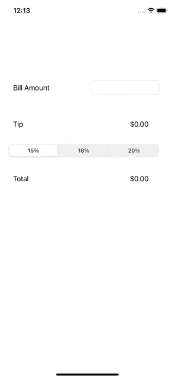

# Pre-work - *Tip Calculator*

**Tip Calculator** is a tip calculator application for iOS.

Submitted by: **Russell Elliott**

Time spent: **1** hours spent in total

## User Stories

The following **required** functionality is complete:

* [x] User can enter a bill amount, choose a tip percentage, and see the tip and total values.
* [x] User can select between tip percentages by tapping different values on the segmented control and the tip value is updated accordingly

The following **optional** features are implemented:

* [ ] UI animations
* [ ] Remembering the bill amount across app restarts (if <10mins)
* [ ] Using locale-specific currency and currency thousands separators.
* [ ] Making sure the keyboard is always visible and the bill amount is always the first responder. This way the user doesn't have to tap anywhere to use this app. Just launch the app and start typing.

The following **additional** features are implemented:

- [ ] List anything else that you can get done to improve the app functionality!

## Video Walkthrough

Here's a walkthrough of implemented user stories:

## Notes

One interesting issue I encountered was with the tip calculation logic being triggered when changing the bill amount. For the slider, I followed the steps outlined in the tutorial, making a function called `calculate()` to update the tip whenever the slider changed. I wanted to do the same for the bill amount.

So, I did the following:
1. ctrl-dragged the button and made an action for "editing changed".
2. moved the calculation logic to a function called `calc()`.
3. rename `calculate()` to `tipSliderChanged()` or something like that.
I experienced issues in the 3rd step, in that when I tried to rename the `calcualte`cfunction, a bunch of errors occurred and the app crashed.

Since steps 1 and 2 worked, I didn't bother renaming `calculate()` to something more meaningful, as I was focused on getting the app working.

## License

    Copyright 2022 Russell Elliott

    Licensed under the Apache License, Version 2.0 (the "License");
    you may not use this file except in compliance with the License.
    You may obtain a copy of the License at

        http://www.apache.org/licenses/LICENSE-2.0

    Unless required by applicable law or agreed to in writing, software
    distributed under the License is distributed on an "AS IS" BASIS,
    WITHOUT WARRANTIES OR CONDITIONS OF ANY KIND, either express or implied.
    See the License for the specific language governing permissions and
    limitations under the License.
